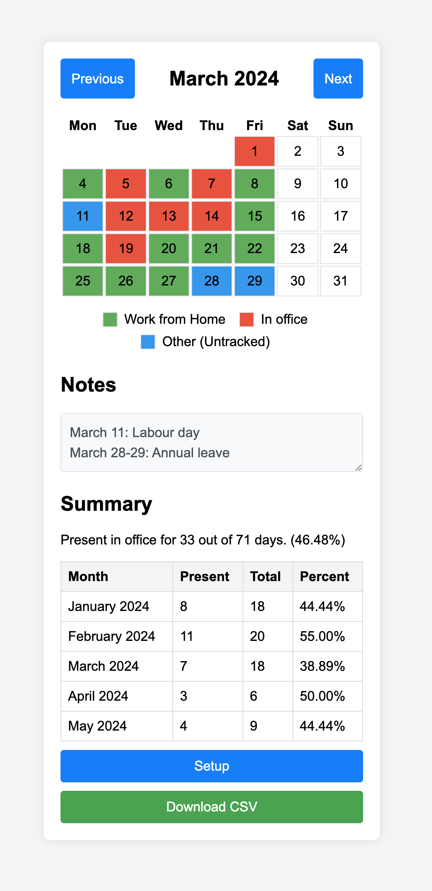

# Office Tracker

---

[Live demo](https://iwasintheoffice.com)



## Description

Office Tracker is a web application designed to track daily office presence on a monthly basis. The application supports two modes of operation:

1. **Integrated Mode**: Stores data on a cloud postgres instance and uses GitHub OAuth for user authentication.
2. **Standalone Mode**: Employs local storage for data and does not require user authentication.

## Run Guide

### Integrated Mode

To run the application in Integrated Mode, it is recommended to use the provided Dockerfile. Alternatively, you can pull the latest Docker image from the Google Artifact Registry:

`asia-southeast1-docker.pkg.dev/baileybutler-syd/officetracker/officetracker:latest`

You will need to create a `config/local.env` file based on the provided `sample.env` and populate it with the required environment variables.

**Running the Application:**

```shell
docker compose up
```

### Standalone Mode

To run the application in Standalone Mode, compile the Go code with the `standalone` build tag:

```shell
go build -tags=standalone -o officetracker .
```

Then, execute the binary:

```shell
./officetracker
```

You can also run the binary with optional flags:
- `-port`: Specify the port the server should listen on (default is `8080`).
- `-database`: Specify the path to the database file (default is `officetracker.db`).

Example:

```shell
./officetracker -port 1234 -database mydb.db
```
