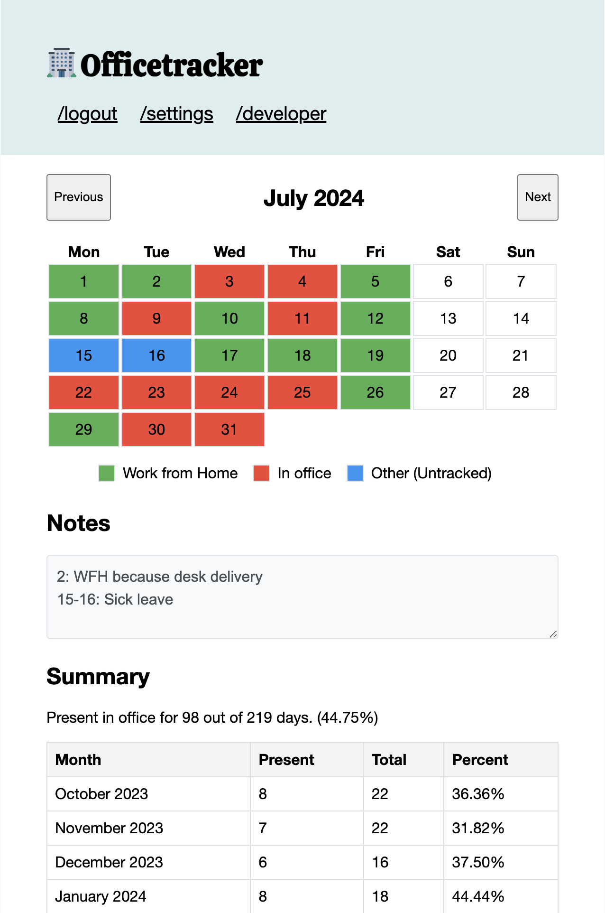

# Office Tracker
A web application designed to track compliance with Return-to-Office (RTO) mandates, featuring a user-friendly calendar interface for logging office presence and generating comprehensive summary statistics and reports for compliance assessment.



## Features

- 📊 Track daily office presence on a monthly basis
- 🔄 Real-time updates and synchronization
- 📱 Responsive web interface
- 📊 Export reports in CSV and PDF formats
- 🔐 GitHub OAuth authentication (in integrated mode)
- 🚀 Multiple deployment options (standalone or integrated)
- 🐳 Docker support for easy deployment

## Deployment Options

### Integrated Mode

The integrated mode offers a full-featured experience with:
- Cloud PostgreSQL database storage
- Redis caching
- GitHub OAuth authentication
- Multi-user support

#### Prerequisites
- Docker and Docker Compose
- GitHub OAuth credentials
- PostgreSQL database
- Redis instance

#### Configuration

1. Copy the sample configuration:
```shell
cp config/sample.env config/local.env
```

2. Configure your `local.env` with required credentials and settings

#### Running with Docker

```shell
docker compose up
```

Alternatively, pull the latest image:
```shell
docker pull asia-southeast1-docker.pkg.dev/baileybutler-syd/officetracker/officetracker:latest
```

### Standalone Mode

Perfect for personal use or testing, standalone mode runs with:
- Local SQLite database
- No authentication required
- Single-user focused

#### Building from Source

```shell
go build -tags=standalone -o officetracker .
```

#### Running Standalone

```shell
./officetracker
```

Command line options:
- `-port`: HTTP server port (default: 8080)
- `-database`: SQLite database path (default: officetracker.db)

Example:
```shell
./officetracker -port 1234 -database mydb.db
```

## Development

### Project Structure
- `/internal`: Core application logic
- `/pkg`: Shared models and utilities
- `/config`: Configuration templates
- `/docs`: Documentation and assets
- `/tests`: Test suites

### Requirements
- Go 1.23
- PostgreSQL (for integrated mode)
- Redis (for integrated mode)
- GitHub OAuth App (for integrated mode)

## Contributing

For bugs, questions, and discussions please use the GitHub Issues.

## Live Demo

Try it out at [https://iwasintheoffice.com](https://iwasintheoffice.com)
